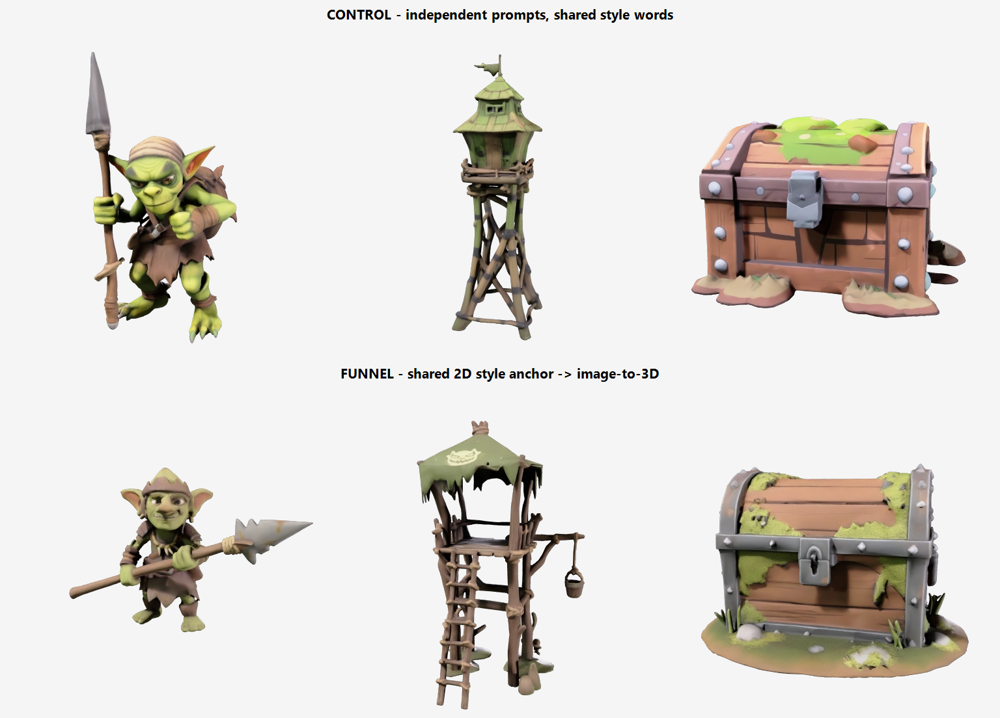

# Greenlight

Approve one image. Get a matching 3D set.

Generate game assets separately and they won't match: no seed, no style ID, each
generation interprets your style keywords fresh. This tool anchors every asset to
one approved style sheet instead, and packages the result so it survives past the
weekend.



Both rows used the same prompts and the same style keywords. The only difference
is the pipeline.

## Try it in 60 seconds

```bash
git clone https://github.com/KyodanCFG/greenlight.git
cd greenlight
npm install
npm start   # http://localhost:3000
```

No API key needed for a first look: without one, the app boots into **sample
mode**, a read-only replay of a real recorded session with spinning models. To
generate your own, put a Meshy API key in `.env` (`cp .env.example .env`); API
access needs a paid Meshy plan, and a credit works out to about 2¢.

Your key stays server-side. The browser only ever talks to this app.

## The loop

1. **Brief in, style sheet out** (~20 s, ~3 credits). One image defines the whole
   set's art direction. Reroll until it looks like your game.
2. **Approve it, list your assets**: name, one-line description, optional
   intended height. Cost is on the button before you commit.
3. **Concepts draw** (~3 credits each), then the pipeline **pauses for review**.
   Approve a concept to lift it (~15 credits), reroll it with an edited
   description, or drop it. The occasional bad concept gets caught for pennies
   here instead of becoming a 15-credit collage.
4. **Approved concepts lift to textured 3D**, anchored to your sheet, with live
   progress. Failures surface the API's real error with one-click retry; failed
   tasks cost nothing.
5. **Export the kit**: every format plus PBR textures downloaded to disk, an
   engine-import README, licence notes for your plan tier, and a manifest with
   every prompt and task ID.

A three-asset set runs about four minutes and ~57 credits.

## Reading the integration

The repo is meant to be read as much as run. The Meshy integration is three small
files with no framework and no build step:

| File | What it shows |
| --- | --- |
| [server/meshy.js](server/meshy.js) | The entire API client. Per-endpoint versioning (text-to-3d is v2, the image endpoints are v1), task polling that survives network blips, and the two flavors of 429 |
| [server/orchestrator.js](server/orchestrator.js) | The pipeline: text-to-image sheet → image-to-image concepts via `reference_image_urls` → image-to-3d via `input_task_id`, with the review gates between stages |
| [server/kit.js](server/kit.js) | The last mile: downloading every format before Meshy's 3-day deletion, provenance manifest, licence notes |

Things the code handles that the docs won't warn you about, each verified
against the official documentation during the build:

- **Failed generations arrive as HTTP 200.** The failure lives in the task
  object's `status` and `task_error`; code that checks response codes records
  failures as wins.
- **`enable_pbr` defaults to false.** A default call silently ships base color
  only, with no normal, metallic, or roughness maps.
- **Asset URLs are signed and expire; files are deleted server-side after 3
  days** on non-Enterprise plans. Anything you keep, you download.
- **Concurrency, not request rate, is the real limit.** Every non-Enterprise
  tier gets 20 req/s; what scales with plan is queued tasks, and the queue-full
  429 clears on task completion, not on a timer.

The design itself came out of a controlled experiment: same prompts through two
pipelines, with the negative result published:
[experiments/EXP01_FINDINGS.md](experiments/EXP01_FINDINGS.md).

## Honest limits

- **Anchored, not identical.** No seed exists; texture values can drift at the
  3D stage. The set reads as one game, but pixel-exact palette compliance it
  is not.
- **Placeholder-grade geometry.** ~30k triangles of loose shells per asset, and
  every model normalizes to ~2 m on its longest axis regardless of subject
  (the API's `auto_size` tested too unreliable to adopt). Intended heights you
  enter are recorded in the kit for import scaling.
- **One project per server process.** Exported kits and downloads persist in
  `kit-output/`; in-flight state does not survive a restart.
- Rigging and animation are out of scope: the API's auto-rigging is
  humanoid-only with a fixed animation library, which fits character pipelines,
  not prop kits.

Works alongside Meshy's own 3D Agent rather than replacing it: the Agent
generates inside the Meshy web app; this adds the pre-spend gates, the readable
API workflow, and an exported kit that outlives asset retention.

MIT licensed. Generated sample assets were created on a paid Meshy plan; see
[LICENSE](LICENSE) and the kit's licence notes for details.
